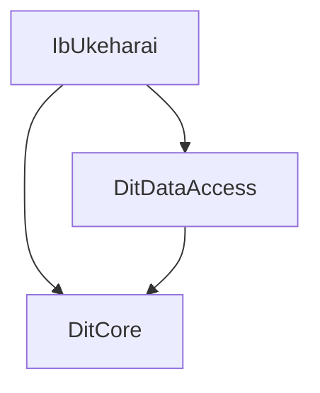

# IbUkeharai システム - システム構成

## 1. 概要
   
IbUkeharaiシステムは受払管理システム（在庫管理システム）として、.NET Framework 4.6を使用したWindowsフォームアプリケーションです。システムは以下の3つの主要サブプロジェクトで構成されています：

- **IbUkeharai**: メインアプリケーション（UI、ビジネスロジック）
- **DitCore**: 共通ユーティリティ（設定管理、ダイアログなど）
- **DitDataAccess**: データベースアクセス層

## 2. プロジェクト依存関係
   

## 3. 技術スタック
   
- 言語: VB.NET
- フレームワーク: .NET Framework 4.6
- UI: Windows Forms
- データベース: SQL Server
- レポート: Microsoft Reporting Services (RDLC)
