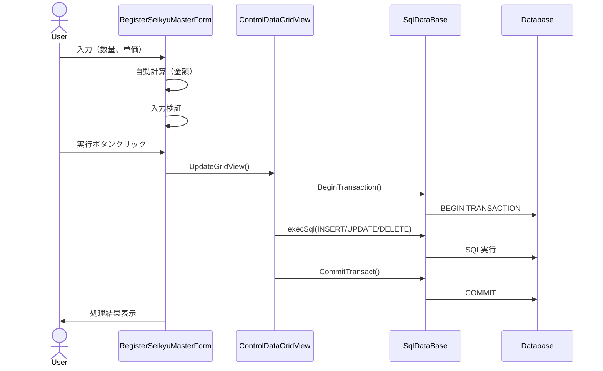
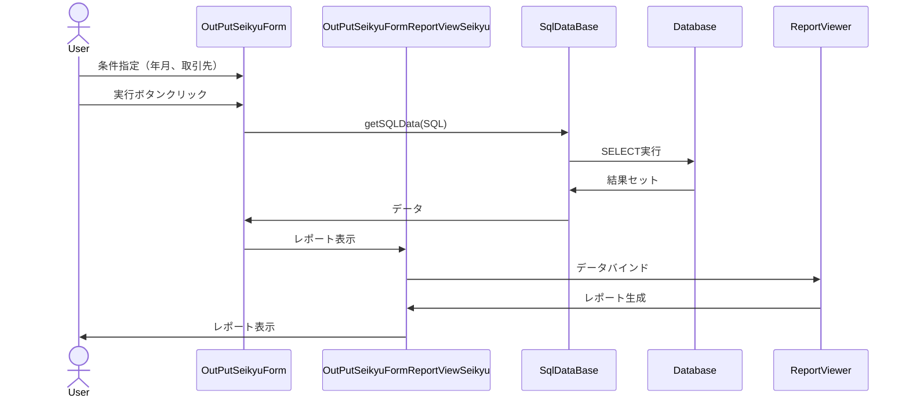
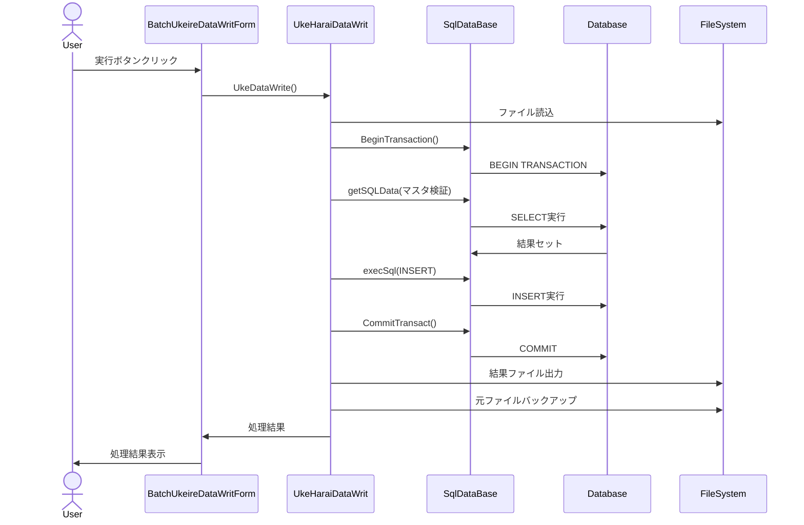
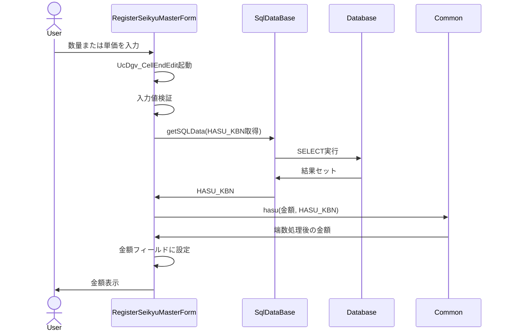

# IbUkeharai システム - データフロー
   
## 1. 登録機能のデータフロー
   
### 1.1 請求マスタ登録の例
   
1. **UI入力**:
   - ユーザーが請求マスタ登録フォーム（RegisterSeikyuMasterForm）でデータを入力
   - 数量（SURYO）と単価（TANKA）を入力すると、金額（KINGAKU）が自動計算される
   - 未入力フィールドの背景色がMistyRoseに変更される

2. **データ検証**:
   - 必須項目の入力チェック（未入力の場合は背景色が変更される）
   - コード値の存在チェック（存在しない場合はエラーメッセージを表示）
   - 数値の妥当性チェック

3. **データベース操作**:
   - 「実行」ボタンクリック時にRBM_ExecutButton_Clickイベントハンドラが起動
   - UcDgv.UpdateGridView()メソッドがデータベース更新処理を実行
   - トランザクション開始（BeginTransaction）
   - INSERT/UPDATE/DELETE SQLの実行
   - トランザクションコミット（CommitTransact）

   
## 2. 帳票出力のデータフロー
   
### 2.1 請求書出力の例
   
1. **条件指定**:
   - ユーザーが請求書出力フォーム（OutPutSeikyuForm）で出力条件を指定
   - 年月と取引先を選択

2. **データ取得**:
   - 「実行」ボタンクリック時にOPS_ExecutButton_Clickイベントハンドラが起動
   - データベースから請求データを取得
   - 請求ヘッダ（T_SEIKYU）と請求明細（T_SEIKYUM）を結合して取得

3. **レポート生成**:
   - OutPutSeikyuFormReportViewSeikyuフォームでレポートを表示
   - Microsoft Reporting Servicesを使用してRDLCテンプレートにデータをバインド
   - レポート出力（プレビューまたは印刷）

   
## 3. バッチ処理のデータフロー
   
### 3.1 受入データ書き込みの例
   
1. **データ読込**:
   - UkeHaraiDataWritクラスがファイルからデータを読み込み
   - データの形式を検証
   - CSVファイルから受入データを読み込み

2. **データ処理**:
   - トランザクション開始（BeginTransaction）
   - データの変換と検証
   - マスタデータとの整合性チェック
   - 取引先マスタ（M_TORI）で取引先コード検証
   - 部品マスタ（M_BUHIN）で部品コード検証

3. **データベース更新**:
   - T_UKEHARAIMEISAIテーブルへのINSERT
   - T_UKEHARAIJISSEKIテーブルの更新
   - トランザクションコミット（CommitTransact）
   - 処理結果をOK/ERRファイルに出力
   - 元ファイルをバックアップ

## 4. 自動計算機能のデータフロー

1. **入力イベント**:
   - ユーザーが数量（SURYO）または単価（TANKA）を入力
   - UcDgv_CellEndEditイベントハンドラが起動

2. **入力検証**:
   - 数量と単価の入力値を検証
   - 未入力の場合は背景色をMistyRoseに変更

3. **端数処理区分取得**:
   - 取引先マスタ（M_TORI）から端数処理区分（HASU_KBN）を取得

4. **金額計算**:
   - 数量 × 単価 = 金額
   - Common.hasuメソッドで端数処理
   - 金額（KINGAKU）フィールドに設定

