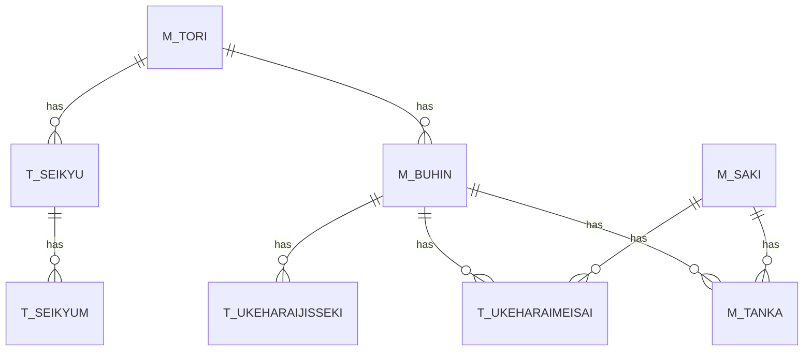

# IbUkeharai システム - データベース構造
   
## 1. 主要テーブル
   
### 1.1 マスタテーブル
   
- **M_TORI**: 取引先マスタ
  - TORI_CD: 取引先コード
  - TORI_NAME: 取引先名
  - SEIKYU_TYPE: 請求タイプ
  - RITU: 率
  - HASU_KBN: 端数処理区分（1=四捨五入、2=切り捨て、3=切り上げ）

- **M_BUHIN**: 部品マスタ
  - TORI_CD: 取引先コード
  - BUHIN_CD: 部品コード
  - BUHIN_NAME: 部品名
  - TANA_NO1-3: 棚番

- **M_SAKI**: 納入先マスタ
  - SAKI_CD: 納入先コード
  - SAKI_NAME: 納入先名

- **M_TANKA**: 単価マスタ
  - TORI_CD: 取引先コード
  - BUHIN_CD: 部品コード
  - SAKI_CD: 納入先コード
  - YUKO_FM: 有効開始日
  - YUKO_TO: 有効終了日
  - TANKA: 単価

### 1.2 トランザクションテーブル

- **T_UKEHARAIMEISAI**: 受払明細
  - TORI_CD: 取引先コード
  - BUHIN_CD: 部品コード
  - UKEHARA_YYYYMMDD: 受払日付
  - DEN_NO: 伝票番号
  - UKEHARAI_KBN: 受払区分
  - KOSU: 個数
  - SAKI_CD: 納入先コード
  - KINGAKU: 金額
  - TESU: 手数

- **T_UKEHARAIJISSEKI**: 受払実績
  - TORI_CD: 取引先コード
  - BUHIN_CD: 部品コード
  - UKEHARA_YYYYMM: 受払年月
  - UKESU: 受入数
  - HARASU: 払出数

- **T_SEIKYU**: 請求ヘッダ
  - TORI_CD: 取引先コード
  - SEIKYU_YYYYMM: 請求年月
  - SEIKYU_TYPE: 請求タイプ
  - SEIKYU_NO: 請求番号
  - KAZEI: 課税対象額
  - HIKAZEI: 非課税対象額
  - SYOHIZEI: 消費税額
  - GOUKEI: 合計金額

- **T_SEIKYUM**: 請求明細
  - TORI_CD: 取引先コード
  - SEIKYU_YYYYMM: 請求年月
  - SEIKYU_TYPE: 請求タイプ
  - SEIKYU_NO: 請求番号
  - SEIKYU_SQNO: 連番
  - BUHIN_CD: 部品コード
  - SURYO: 数量
  - TANKA: 単価
  - KINGAKU: 金額
  - TANI: 単位

## 2. テーブル関連図



## 3. 主要なSQL文

### 3.1 取引先マスタの取得
```sql
SELECT TORI_CD, TORI_NAME, SEIKYU_TYPE, RITU, HASU_KBN
FROM Ukeharai.M_TORI
WHERE TORI_CD = '10001'
```

### 3.2 請求明細の取得
```sql
SELECT T_SEIKYUM.TORI_CD, T_SEIKYUM.SEIKYU_YYYYMM, T_SEIKYUM.SEIKYU_TYPE, 
       T_SEIKYUM.SEIKYU_NO, T_SEIKYUM.BUHIN_CD, M_BUHIN.BUHIN_NAME,
       T_SEIKYUM.SURYO, T_SEIKYUM.TANKA, T_SEIKYUM.KINGAKU, T_SEIKYUM.TANI
FROM Ukeharai.T_SEIKYUM
INNER JOIN Ukeharai.M_BUHIN ON T_SEIKYUM.TORI_CD = M_BUHIN.TORI_CD 
                           AND T_SEIKYUM.BUHIN_CD = M_BUHIN.BUHIN_CD
WHERE T_SEIKYUM.TORI_CD = '10001'
  AND T_SEIKYUM.SEIKYU_YYYYMM = '202505'
  AND T_SEIKYUM.SEIKYU_TYPE = '1'
  AND T_SEIKYUM.SEIKYU_NO = '0001'
ORDER BY T_SEIKYUM.SEIKYU_SQNO
```

### 3.3 受払明細の登録
```sql
INSERT INTO Ukeharai.T_UKEHARAIMEISAI
(TORI_CD, BUHIN_CD, UKEHARA_YYYYMMDD, DEN_NO, UKEHARAI_KBN, KOSU, SAKI_CD, KINGAKU, TESU)
VALUES
('10001', 'P001', '20250520', '0001', '1', 10, '001', 10000, 1)
```

### 3.4 受払実績の更新
```sql
UPDATE Ukeharai.T_UKEHARAIJISSEKI
SET UKESU = UKESU + 10
WHERE TORI_CD = '10001'
  AND BUHIN_CD = 'P001'
  AND UKEHARA_YYYYMM = '202505'
```

### 3.5 請求ヘッダの登録
```sql
INSERT INTO Ukeharai.T_SEIKYU
(TORI_CD, SEIKYU_YYYYMM, SEIKYU_TYPE, SEIKYU_NO, KAZEI, HIKAZEI, SYOHIZEI, GOUKEI)
VALUES
('10001', '202505', '1', '0001', 10000, 0, 1000, 11000)
```

### 3.6 請求明細の登録
```sql
INSERT INTO Ukeharai.T_SEIKYUM
(TORI_CD, SEIKYU_YYYYMM, SEIKYU_TYPE, SEIKYU_NO, SEIKYU_SQNO, BUHIN_CD, SURYO, TANKA, KINGAKU, TANI)
VALUES
('10001', '202505', '1', '0001', 1, 'P001', 10, 1000, 10000, '個')
```

## 4. ストアドプロシージャ

### 4.1 月次データ更新
```sql
CREATE PROCEDURE Ukeharai.Update_Month_Data
    @TORI_CD NVARCHAR(10),
    @BUHIN_CD NVARCHAR(20),
    @UKEHARA_YYYYMM NVARCHAR(6)
AS
BEGIN
    -- 受払実績の更新
    UPDATE Ukeharai.T_UKEHARAIJISSEKI
    SET UKESU = (
            SELECT SUM(KOSU)
            FROM Ukeharai.T_UKEHARAIMEISAI
            WHERE TORI_CD = @TORI_CD
              AND BUHIN_CD = @BUHIN_CD
              AND SUBSTRING(UKEHARA_YYYYMMDD, 1, 6) = @UKEHARA_YYYYMM
              AND UKEHARAI_KBN = '1'
        ),
        HARASU = (
            SELECT SUM(KOSU)
            FROM Ukeharai.T_UKEHARAIMEISAI
            WHERE TORI_CD = @TORI_CD
              AND BUHIN_CD = @BUHIN_CD
              AND SUBSTRING(UKEHARA_YYYYMMDD, 1, 6) = @UKEHARA_YYYYMM
              AND UKEHARAI_KBN = '2'
        )
    WHERE TORI_CD = @TORI_CD
      AND BUHIN_CD = @BUHIN_CD
      AND UKEHARA_YYYYMM = @UKEHARA_YYYYMM
END
```

### 4.2 単価情報取得
```sql
CREATE PROCEDURE Ukeharai.Get_TankaInfo
    @TORI_CD NVARCHAR(10),
    @BUHIN_CD NVARCHAR(20),
    @SAKI_CD NVARCHAR(10),
    @UKEHARA_YYYYMMDD NVARCHAR(8)
AS
BEGIN
    SELECT TOP 1 TANKA
    FROM Ukeharai.M_TANKA
    WHERE TORI_CD = @TORI_CD
      AND BUHIN_CD = @BUHIN_CD
      AND SAKI_CD = @SAKI_CD
      AND YUKO_FM <= @UKEHARA_YYYYMMDD
      AND YUKO_TO >= @UKEHARA_YYYYMMDD
    ORDER BY YUKO_FM DESC
END
```
