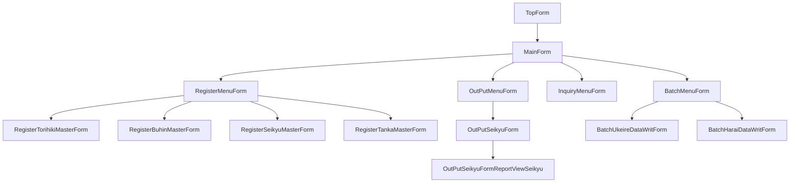

# IbUkeharai システム - フォーム構造

## 1. フォーム継承階層
   
### 1.1 基本フォーム
   
#### 1.1.1 Form
すべてのフォームの基底クラス（.NET Framework標準）
   
#### 1.1.2 BaseMenuForm
メニューフォームの基底クラス。以下の機能を提供：
- タイトルとタイトル色の設定
- 子フォームの表示と管理
   
#### 1.1.3 RegisterBaseForm
登録フォームの基底クラス。以下の機能を提供：
- タイトル設定
- 「実行」と「戻る」ボタン
- データグリッド管理（_gridViewInfo）
   
### 1.2 メニューフォーム
   
#### 1.2.1 TopForm
アプリケーションのメインエントリポイント。メインメニューを表示し、各機能グループへのナビゲーションを提供。
   
#### 1.2.2 RegisterMenuForm
登録機能のメニューを提供。各種マスタ登録フォームへのナビゲーションボタンを表示。
   
#### 1.2.3 BatchMenuForm
バッチ処理機能のメニューを提供。各種バッチ処理フォームへのナビゲーションボタンを表示。

## 2. 画面遷移フロー

## 3. 主要フォームの機能

### 3.1 TopForm
- アプリケーションのメインエントリポイント
- ログイン処理
- MainFormの表示

### 3.2 MainForm
- 主要機能グループへのナビゲーション
- 各メニューフォームの表示

### 3.3 RegisterMenuForm
- 登録機能へのナビゲーション
- 各マスタ登録フォームの表示

### 3.4 RegisterSeikyuMasterForm
- 請求マスタの登録・編集・削除
- 自動計算機能（数量×単価＝金額）
- 入力促進機能（未入力フィールドの背景色変更）
- 手入力防止機能（金額フィールドの読み取り専用設定）

### 3.5 OutPutSeikyuForm
- 請求書出力条件の指定
- 請求データの取得
- OutPutSeikyuFormReportViewSeikyuの表示

### 3.6 OutPutSeikyuFormReportViewSeikyu
- 請求書レポートの表示
- 印刷機能
