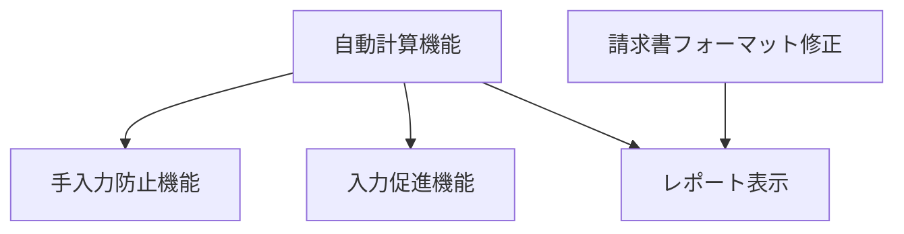

# IbUkeharai システム - 最近実装された機能
   
## 1. 自動計算機能
   
### 1.1 概要
請求マスタ登録画面（RegisterSeikyuMasterForm）において、数量（SURYO）と単価（TANKA）を入力すると、金額（KINGAKU）が自動的に計算される機能。

### 1.2 実装箇所
RegisterSeikyuMasterForm.vbのUcDgv_CellEndEditメソッド

```vb
Private Sub UcDgv_CellEndEdit(sender As Object, e As DataGridViewCellEventArgs) Handles UcDgv.CellEndEdit
    ' 数量または単価が変更された場合
    If "SURYO".Equals(dataGridViewColumn.Name) OrElse "TANKA".Equals(dataGridViewColumn.Name) Then
        ' 数量と単価の値を取得
        Dim suryo As Decimal = 0
        Dim tanka As Decimal = 0
        Dim hasValue As Boolean = True
        
        ' 数量の検証
        If IsNothing(dataGridViewRow.Cells("SURYO").Value) OrElse 
           String.IsNullOrEmpty(Conversions.ToString(dataGridViewRow.Cells("SURYO").Value)) Then
            dataGridViewRow.Cells("SURYO").Style.BackColor = Color.MistyRose
            hasValue = False
        Else
            Decimal.TryParse(Conversions.ToString(dataGridViewRow.Cells("SURYO").Value), suryo)
            dataGridViewRow.Cells("SURYO").Style.BackColor = Me._bkcolor_normal
        End If
        
        ' 単価の検証
        If IsNothing(dataGridViewRow.Cells("TANKA").Value) OrElse 
           String.IsNullOrEmpty(Conversions.ToString(dataGridViewRow.Cells("TANKA").Value)) Then
            dataGridViewRow.Cells("TANKA").Style.BackColor = Color.MistyRose
            hasValue = False
        Else
            Decimal.TryParse(Conversions.ToString(dataGridViewRow.Cells("TANKA").Value), tanka)
            dataGridViewRow.Cells("TANKA").Style.BackColor = Me._bkcolor_normal
        End If
        
        ' 数量と単価の両方が入力されている場合、金額を計算
        If hasValue Then
            ' 取引先情報から端数処理方法を取得
            Dim hasuKbn As String = "1" ' デフォルト値
            Using sqlDataBase As New SqlDataBase(Me._conf.xmlConfData.xDataBase)
                Dim sql As String = "SELECT HASU_KBN FROM Ukeharai.M_TORI WHERE TORI_CD = '" & Me.ComboTori1.Text.Trim() & "'"
                If sqlDataBase.execSql(sql) Then
                    If sqlDataBase.DbData.DataList.Count > 0 Then
                        hasuKbn = Conversions.ToString(sqlDataBase.DbData.DataList(0)("HASU_KBN"))
                    End If
                End If
            End Using
            
            ' 金額を計算（数量 × 単価）
            Dim kingaku As Decimal = suryo * tanka
            
            ' 端数処理（取引先マスタのHASU_KBNに基づく）
            kingaku = Common.hasu(kingaku, hasuKbn)
            
            ' 金額を設定
            dataGridViewRow.Cells("KINGAKU").Value = kingaku
        End If
    End If
End Sub
```

### 1.3 特徴
- 数量（SURYO）または単価（TANKA）のセル編集完了時に自動計算
- 取引先マスタ（M_TORI）の端数処理区分（HASU_KBN）に基づいて端数処理
- Common.hasuメソッドを使用して端数処理（四捨五入、切り捨て、切り上げ）
- 金額（KINGAKU）フィールドは読み取り専用に設定され、手入力を防止

## 2. 入力促進機能
   
### 2.1 概要
未入力フィールドの背景色をMistyRoseに変更して入力を促す機能。

### 2.2 実装箇所
RegisterSeikyuMasterForm.vbのUcDgv_CellEndEditメソッド

```vb
' 数量の検証
If IsNothing(dataGridViewRow.Cells("SURYO").Value) OrElse 
   String.IsNullOrEmpty(Conversions.ToString(dataGridViewRow.Cells("SURYO").Value)) Then
    dataGridViewRow.Cells("SURYO").Style.BackColor = Color.MistyRose
    hasValue = False
Else
    Decimal.TryParse(Conversions.ToString(dataGridViewRow.Cells("SURYO").Value), suryo)
    dataGridViewRow.Cells("SURYO").Style.BackColor = Me._bkcolor_normal
End If
```

### 2.3 特徴
- IsNothingまたはString.IsNullOrEmptyで未入力検出
- 未入力フィールドの背景色をColor.MistyRoseに変更
- 入力があれば背景色を通常色（_bkcolor_normal）に戻す

## 3. 手入力防止機能
   
### 3.1 概要
金額（KINGAKU）フィールドを読み取り専用に設定し、手入力を防止する機能。

### 3.2 実装箇所
RegisterSeikyuMasterForm.vbのInitializeDataGridViewメソッド

```vb
' 金額フィールドを読み取り専用に設定
Private Sub InitializeDataGridView()
    ' 金額列を読み取り専用に設定
    Dim kingakuColumn As DataGridViewColumn = Me.UcDgv.CustDgv.Columns("KINGAKU")
    kingakuColumn.ReadOnly = True
    kingakuColumn.DefaultCellStyle.BackColor = Me._bkcolor_readonly
End Sub
```

### 3.3 特徴
- 金額（KINGAKU）列のReadOnlyプロパティをTrueに設定
- 背景色を読み取り専用色（_bkcolor_readonly）に設定
- ユーザーによる手入力を防止し、計算値のみを使用

## 4. 請求書フォーマット修正
   
### 4.1 概要
請求書レポート（OutputSeikyuReportS.rdlc）において、数量と単位を分離し、間に線を表示する機能。

### 4.2 実装箇所
OutputSeikyuReportS.rdlcのTextbox定義

```xml
<!-- 数量の表示 -->
<Textbox Name="SURYO">
  <Value>=Format(Fields!SURYO.Value,"#,###")</Value>
  <Style>
    <TextAlign>Right</TextAlign>
    <RightBorder>
      <Style>Solid</Style>
      <Width>0.5pt</Width>
    </RightBorder>
  </Style>
</Textbox>

<!-- 単位の表示 -->
<Textbox Name="TANI">
  <Value>=Fields!TANI.Value</Value>
  <Style>
    <TextAlign>Left</TextAlign>
    <LeftBorder>
      <Style>Solid</Style>
      <Width>0.5pt</Width>
    </LeftBorder>
  </Style>
</Textbox>
```

### 4.3 特徴
- 数量と単位を別々のTextboxに分離
- 数量は右寄せ、単位は左寄せで表示
- 数量と単位の間に縦線（Solid, 0.5pt）を表示
- 数量は桁区切りでフォーマット（Format(Fields!SURYO.Value,"#,###")）

## 5. 機能間の関連性



## 6. 影響範囲

### 6.1 影響を受ける機能
- 請求マスタ登録機能
- 請求書出力機能

### 6.2 影響を受けないと想定される機能
- 取引先マスタ登録機能
- 部品マスタ登録機能
- 単価マスタ登録機能
- 受払実績表出力機能
- バッチ処理機能

### 6.3 潜在的なリスク
- 大きな数値や小数点以下の値の計算精度
- 負の値の処理
- 端数処理の一貫性
- パフォーマンスへの影響（大量データ処理時）
